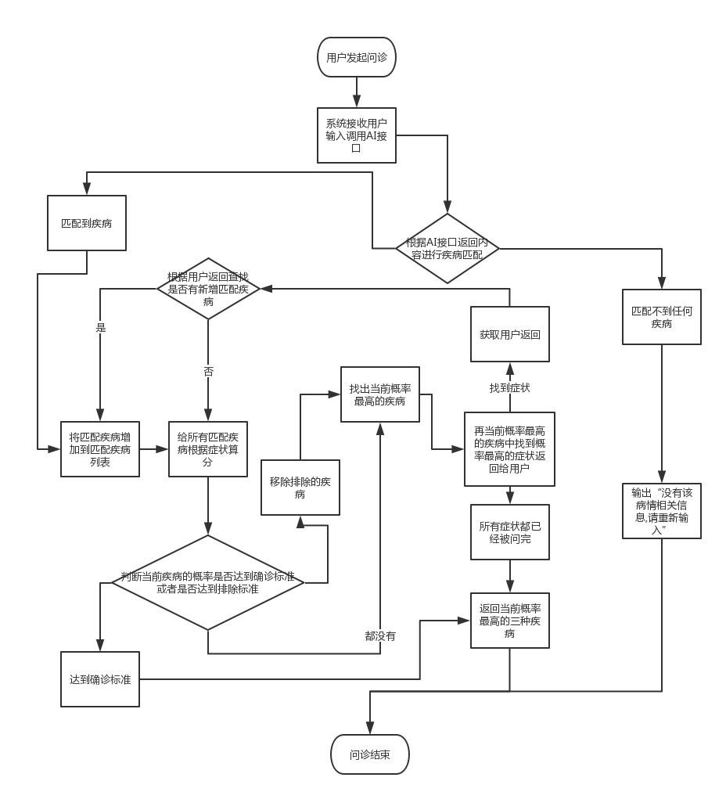

## AI问诊流程

#### 整体流程

    用户发起询问->系统接收询问并发起AI接口调用->获取AI接口返回症状->根据AI接口返回症状进行匹配
    
    未匹配到相关疾病->返回 "没有该病情相关信息,请重新输入" 结束问诊
    
    匹配到相关疾病->对匹配到的疾病根据症状进行算分
    ->根据算分进行排序，找到分最高（即当前概率最高）的疾病<------------------------------------------\
    ->从该疾病中找到当前概率最高的症状->将该症状拼为反问语句返回给用户->将用户返回的状态跟反问症状组合->\
    ->根据当前症状组合对所有疾病重新算分
    
    算分过程中如果发现某疾病的扣分已经达到最大扣分线->从匹配疾病中移除该疾病，不再参与后续的待问症状提取及算分

    算分过程中如果发现某疾病的概率已经达到确诊线->返回该疾病以及其他两个概率排行前二的疾病
    
    算分过程中如果发现匹配到的疾病所有症状都已经问完->返回目前概率排行前三的疾病
    
#### 流程图

#### 流程分类细节实现

- 调用AI接口及匹配：

    如果AI接口失败，则将调用内容作为返回内容直接进行匹配，反之，则使用AI接口返回内容进行匹配。将返回内容在ASK_CONTENT 跟SPLIT_CONTENT中进行匹配，如果在ASK_CONTENT中直接匹配上，则直接用该症状作为直接匹配，如果在SPLIT_CONTENT中匹配上，则记为部分匹配，匹配疾病进入轮询疾病列表但暂不计分，匹配到的症状反问用户后再进行计分。

- 算分：
    
    从疾病症状树顶层开始递归遍历，如果节点已经被询问，则根据返回内容“是|否”进行算分，是则增加chance相应分值，否则扣除chance相应分值，子节点的分值结合父节点的关系给出父节点的分值，以此倒推得到整个疾病树的分值。

- 算分子流程-父子关系算分：

    如果父节点为';'关系，则为并列关系，父节点的分值为子节点分值之和且最大值不超过父节点总分
    
    如果父节点为'&'关系，则为并且关系，子节点全部都为是才计分，只要有一个否 则父节点不得分
    
    如果父节点为'|'关系，则为或关系，子节点中只要有一个得分，则父节点就得分，提问过程中会优先提问概率高的子节点，所以实际父节点得分为子节点中分高且第一个为是的节点的得分
    
    如果父节点为->关系，则为发展关系，如果子节点中有连续>=2个子节点为是，则计分
    
- 查找下一个询问症状：

    在目前概率最高的疾病中查找还未被询问的概率最高的症状，然后判断该症状的父节点是否有未被询问过的，如果有，先询问父节点，如果父节点回答为否，则该父节点下的所有节点都不再询问
    如果父节点回答为是，判断父节点关系以及兄弟节点情况，如果父节点为或关系，且兄弟节点已经有是的，则跳过该节点，且该父节点下的所有节点一起跳过
    如果父节点为并且关系，且兄弟节点已经有否，同样跳过该节点，且该父节点下的所有节点一起跳过
    找到第一个可用节点，就是当前可用症状，拼装为反问语句返回。
    如果全部遍历后仍然没找可用症状，则结束问诊。