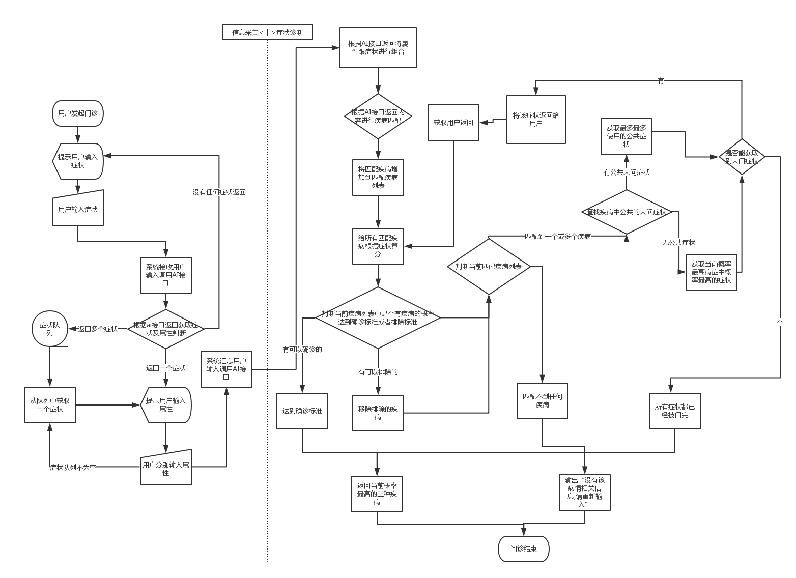

## AI问诊流程

#### 整体流程

- step1: 用户信息采集
    
        采集用户年龄、性别、职业等信息，用户在新建问诊的时候在问诊人信息里面有，系统直接拿来用，不在再次询问
        
- step2:采集症状信息

        询问用户症状，如果用户回答了症状，调用AI接口获取具体症状以及相关属性，并对1-n个症状展开分别的询问症状的相关属性，包括性质、频率等
        一轮回答结束，提问用户是否还有其他症状，如果没有了，结束用户症状采集。
        
- step3:检查信息采集

        询问用户有否做过检查，做过哪些检查，并具体询问检查的细节
        
- step4:采集信息获取疾病列表
        
        根据采集到的信息，匹配疾病并计算概率得分
        
- step5:根据疾病目前概率得分进行判断
        
        如果有疾病的得分达到确诊标准，跳转到[step9] 
        
        如果有疾病得分达到排除标准，则排除该疾病，如果排除后已经没有疾病了，跳转到[step10]
        
- step6:获取当前要询问的症状
        
        在没有问过的症状列表中查找被匹配到的疾病最多疾病中概率最高的症状进行询问，如果没有公共的症状，则直接锁定概率最高的。
        
        如果所有的症状都已经被询问，跳转到[step9]

- step7:返回给用户要询问的症状

        症状返回给用户前，需要根据反问脚本对询问进行封装美化
        
- step8:解析用户返回
        
        如果用户返回的直接在系统定义的是否字典中，则直接标记该症状状态并跳转到[step5]
        
        否则调用ai接口判断用户是直接说的症状还是说的其他是否，如果是其他是否，标记状态并跳转到[step5]
        
        如果用户口述为其他症状跟属性，将这些症状属性加入列表，然后跳转到[step5]
        
- step9:成功结束

        按照概率排序输出当前概率最高的1-3个疾病

- step10:失败结束

        返回目前没有匹配到的疾病
       
    
#### 流程图

#### 流程分类细节实现

- 调用AI接口及匹配：

    如果AI接口失败，则将调用内容作为返回内容直接进行匹配，反之，则使用AI接口返回内容进行匹配。将返回内容在ASK_CONTENT 跟SPLIT_CONTENT中进行匹配，如果在ASK_CONTENT中直接匹配上，则直接用该症状作为直接匹配，如果在SPLIT_CONTENT中匹配上，则记为部分匹配，匹配疾病进入轮询疾病列表但暂不计分，匹配到的症状反问用户后再进行计分。

- 算分：
    
    从疾病症状树顶层开始递归遍历，如果节点已经被询问，则根据返回内容“是|否”进行算分，是则增加chance相应分值，否则扣除chance相应分值，子节点的分值结合父节点的关系给出父节点的分值，以此倒推得到整个疾病树的分值。

- 算分子流程-父子关系算分：

    如果父节点为';'关系，则为并列关系，父节点的分值为子节点分值之和且最大值不超过父节点总分
    
    如果父节点为'&'关系，则为并且关系，子节点全部都为是才计分，只要有一个否 则父节点不得分
    
    如果父节点为'|'关系，则为或关系，子节点中只要有一个得分，则父节点就得分，提问过程中会优先提问概率高的子节点，所以实际父节点得分为子节点中分高且第一个为是的节点的得分
    
    如果父节点为->关系，则为发展关系，如果子节点中有连续>=2个子节点为是，则计分
    
    如果父节点为*关系，则为乘积关系，父节点的分值为子节点中个节点分值之积
    
- 查找下一个询问症状：

    获得一个症状后需要判断该症状的父节点是否有未被询问过的，如果有，先询问父节点，如果父节点回答为否，则该父节点下的所有节点都不再询问
    如果父节点回答为是，判断父节点关系以及兄弟节点情况，如果父节点为或关系，且兄弟节点已经有是的，则跳过该节点，且该父节点下的所有节点一起跳过
    如果父节点为并且关系，且兄弟节点已经有否，同样跳过该节点，且该父节点下的所有节点一起跳过
    找到第一个可用节点，就是当前可用症状，拼装为反问语句返回。
    如果全部遍历后仍然没找可用症状，则结束问诊。